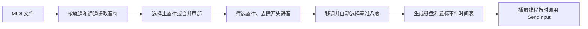

# HarpAutoPlayer 解析记录

已完成 `HarpAutoPlayer.exe` 的单文件解包和主程序集反编译。它是《三角洲行动》口琴自动演奏器 1.0.6，使用 C#、.NET 8、Avalonia 和 DryWetMIDI，把 MIDI 音符转换成按时间执行的键盘、鼠标事件。

本次采用静态分析，没有启动原 EXE、调用其入口或在游戏中验证。`decompiled/` 是 ILSpy 生成的 C#，不是作者原始工程；局部变量名、编译生成的界面代码和工程文件不保证与原工程一致，也尚未验证能否直接重新编译。

以下文件路径以本地分析目录 `/Users/qimo/Documents/code/tmp/harp-analysis` 为基准。
本项目保存分析结论；原 EXE、提取的依赖与反编译 C# 不放入源码或固件包。
ESP32 实现及当前验证范围见 [Harp 项目说明](Harp项目说明.md)。

分析对象及产物：

| 项目 | 结果 |
|---|---|
| 原文件 | `/Users/qimo/Downloads/HarpAutoPlayer.exe` |
| 文件大小 | 94,431,343 字节，约 90.06 MiB |
| 原文件 SHA-256 | `8b54d53976510d1985166d2e71ae172ced10fba6489b97405ebdd3c59bf6af11` |
| 平台 | Windows x64，GUI |
| 程序版本 | `1.0.6.0` |
| 版本信息中的提交标识 | `1cbad3ef0d6348c1134285ec7e401c8f0b2949c2` |
| 依赖 | .NET 8.0.30、Avalonia 11.3.20、DryWetMIDI 7.2.0 |
| 打包形式 | .NET 单文件 bundle v6.0，共 202 个内嵌文件 |
| 主程序集 | `extracted/HarpAutoPlayer.dll`，1,247,744 字节 |
| 主程序集 SHA-256 | `2c0bde93c2939955622ee725c4b39a08db22edbed8b16aafa10d4cfb7b1d420a` |
| 反编译输出 | `decompiled/`，26 个 C# 文件，含编译生成的辅助代码 |
| 提取清单 | `bundle-manifest.json`，含偏移、大小和各文件 SHA-256 |
| 提取工具 | `extract_bundle.py`；仅解析和写出 bundle 内容 |
| 分析工具 | `tools/` 内独立放置 .NET 8.0.31 macOS 运行时与 ILSpy 9.1；没有安装到系统全局目录 |

程序执行流程如下：



MIDI 读取逻辑见 `HarpAutoPlayer.Midi/MidiLoader.cs`（反编译输出第 24 行）。它支持 `.mid/.midi/.kar/.rmi`；普通文件检查 `MThd`，RMI 文件从 RIFF 数据内查找 MIDI 头。使用 DryWetMIDI 读取 TempoMap，再把每个音符的起止 tick 转成秒，因此不是简单用一个固定 BPM 换算整首曲子。

候选旋律按“轨道 × MIDI 通道”划分。每个音符保存 `Pitch`、`Start`、`End`、`Velocity`；读取时会把不足 20 ms 的音符延长到 20 ms。力度被读出，但后续按键输出没有使用它；没有看到把弯音、踏板或表情控制转换成游戏操作的逻辑。

轨道名称先尝试 UTF-8，再尝试 GBK（代码页 936），最后回退 Latin-1。对部分损坏文件会尝试保留完整的 MIDI track chunk 后重新读取，并不能修复任意损坏的 MIDI。

轨道推荐见 `HarpAutoPlayer/MainWindow.cs`（反编译输出第 900 行）：排除被识别为打击乐的候选后，根据轨道名、可演奏比例和音符数量评分。名字含“主旋律 / 人声 / lead / vocal”等加 45 分，含“伴奏 / bass / chord”等减 35 分，可演奏比例最多加 30 分，少于 8 个音符减 20 分。这是规则评分，没有看到机器学习模型。

音高映射的实现见 `HarpAutoPlayer.Engine/NoteMapper.cs`（反编译输出第 107 行）。基础键位表如下，鼠标中键需要按住，与字母键组合输出。

| 十二平均律音级 | 简谱 | 键盘键 | 额外鼠标操作 |
|---|---|---|---|
| C | 1 / do | Z | 无 |
| C♯ / D♭ | ♯1 | Z | 按住中键 |
| D | 2 / re | X | 无 |
| D♯ / E♭ | ♯2 | X | 按住中键 |
| E | 3 / mi | C | 无 |
| F | 4 / fa | V | 无 |
| F♯ / G♭ | ♯4 | V | 按住中键 |
| G | 5 / sol | B | 无 |
| G♯ / A♭ | ♯5 | B | 按住中键 |
| A | 6 / la | N | 无 |
| A♯ / B♭ | ♯6 | N | 按住中键 |
| B | 7 / si | M | 无 |

设移调后的 MIDI 音高为 `p`，程序自动选择的基准八度为 `b`：

```text
p = 原 MIDI 音高 + 移调半音数
音级 = p % 12
所在八度 = p // 12 - 1
相对八度 = 所在八度 - b
```

| 相对八度 | 对应操作 |
|---|---|
| -1 | 基础键位 + 按住鼠标左键 |
| 0 | 基础键位，不按左/右键 |
| +1 | 基础键位 + 按住鼠标右键 |
| +2，且音级为 C 或 C♯ | 逗号键 `,` + 按住右键；C♯ 再按中键 |
| 其他 | 标记为超音域，不发送这个音符 |

因此一个确定的基准八度覆盖 38 个半音位置：`C(b-1)` 到 `C♯(b+2)`。仅以 `b=4` 为例，范围是 MIDI 48～85，即 C3～C♯6；C4 为 Z，C3 为左键+Z，C5 为右键+Z，C6 为右键+逗号。这里的 C4 等名称是源 MIDI 的映射标签，并未实测游戏实际发声的绝对频率。

关键细节是 **基准八度会随曲目自动改变，不固定为 4**。`AutoBaseOctave` 遍历曲目包含的八度，选择能容纳最多音符的基准；数量相同时，选择更接近音符平均八度的基准。界面始终传入 `manualBaseOctave=null`。所以只知道某个 MIDI 音高，还不足以确定最终左/右键状态，必须结合整首候选旋律计算。

手动移调范围是 -10～+10 半音；“一键移调”实际只搜索 -6～+6，优先最少丢音，其次选择绝对值最小的移调量。每个候选移调量也重新计算基准八度。超范围音符被过滤，后面音符的时间戳不因过滤而前移；但总播放时长按剩余按键事件计算，末尾只有不可演奏音时可能提早结束。

旋律预处理的入口见 `HarpAutoPlayer/MainWindow.cs`（反编译输出第 980 行）：

1. 默认开启“同刻多音取最高”。函数名虽然叫 `ChordRootOnly`，实现并非和弦根音分析：先按起始时间、音高排序，把距组首不超过 25 ms 的音符归为一组，再取组内最后一个。因此严格同刻时取最高音；如果起音略有错开，实际可能取最后起音的音。
2. “人声旋律提取”开启时替代上一种筛选。同样按 25 ms 分组，优先考虑 MIDI 50～86 的音；如果这个范围没有音则回退全组。后续优先选择距上个音不超过 5 个半音的候选，否则选最接近上个音的候选。它是音域与连续性规则，不是从音频中分离人声。部分分支同样使用“列表最后一个”，存在与起音排序有关的偏差。
3. 合奏按勾选顺序分配优先级。起音冲突优先选编号小的声部，低优先级长音的尾部可能延后保留；最终交给单音播放调度器处理，不是真正的多音并发演奏。
4. 默认去除开头静音：把所有音符整体减去最早起始时间，保留彼此间隔。

播放调度的实现见 `HarpAutoPlayer.Engine/PlaybackEngine.cs`（反编译输出第 421 行）。每个事件包含时间、键盘/鼠标类型、键码和按下/抬起状态。设计上逐音演奏，发生重叠时尝试将前音结束截到后音起始前 20 ms，并为前音保留至少 10 ms；极密集输入的最终效果仍需实测。

| 调度参数 | 代码中的值 |
|---|---|
| 音符目标最短时长 | 20 ms |
| 前音最短保留 | 10 ms |
| 同一字母键重按间隔 | 至少 12 ms |
| 松开旧八度鼠标键 | 新音前 16 ms |
| 按下新八度鼠标键 | 新音前 12 ms |
| 改变中键升半音状态 | 新音前 8 ms |
| 全局输入提前量 | 固定 25 ms |
| 界面速度范围 | 50%～200% |
| 播放引擎内部速度限制 | 0.1～5 倍 |

以上时间表参数以曲目时间表示，会受播放速度缩放；全局提前量按实现折算后约为实际时间 25 ms。首音之前的负时间事件压到 0 秒，因此首音不能保证完整的修饰键预备间隔。

后台线程用 `Stopwatch` 累积时间，并根据速度推进曲目进度。距离下一事件较远时短暂等待，临近事件时忙等。支持循环、暂停、拖动进度和演奏中移调。可选“呼吸休止”会在累计连续音长超过约 8 秒时插入 90 ms，随后音符整体后移，因此会改变原曲的时间轴。

输入发送见 `HarpAutoPlayer.Input/InputSender.cs`（反编译输出第 154 行）：字母键先经过 `MapVirtualKeyW` 转扫描码，再调用 `SendInput`，使用 `KEYEVENTF_SCANCODE`；鼠标同样通过 `SendInput` 按下/抬起。输入送到系统当前前台窗口，核心发送逻辑没有绑定指定游戏进程。

全局控制默认 F6，也可选 F1～F12 或关闭。实现使用 `WH_KEYBOARD_LL` 键盘钩子，只对配置的控制键作反应，忽略带 `LLKHF_INJECTED` 标记的输入，并做 100 ms 防抖。状态切换是“空闲开始 / 演奏暂停 / 暂停继续 / 倒计时取消”。倒计时可选 0、3、5、10 秒。

配置和运行日志位于 Windows 的 `%LOCALAPPDATA%/HarpAutoPlayer/`：`settings.json`、`play.log`、`instance.lock`。日志超过 2 MiB 时备份为 `.old`。从这次主程序集的代码检查中，没有发现主动网络请求、下载执行或游戏进程内存读写调用；这不是对所有附带运行库及原生 DLL 的完整安全审计。

静态阅读发现的几个实现问题，后续复刻或修复时值得关注：

- **暂停/拖动后可能丢失八度与升半音状态。** 暂停、拖动和实时移调会调用 `ReleaseEverything`，松开鼠标修饰键；恢复时并未完整重建当前位置应当保持的鼠标状态，而事件表只在音区/升号变化时发修饰键事件。如果后续一串音符一直保持同一修饰状态，就可能用错误音区或自然音播放。这由代码路径推断，尚未实测。
- **所谓“取最高”对 25 ms 内略微错开的音不严格成立。** 代码取时间优先排序后的组尾，而不是显式求最大音高。
- **全局热键退出使用了错误类别的线程 ID。** `GlobalHotkeys.Worker` 把 `Environment.CurrentManagedThreadId` 当作 Win32 线程 ID 保存，再交给 `PostThreadMessageW`。它不等同于系统线程 ID，可能导致停止消息无法送达。
- **输入失败不会反馈。** `SendInput` 返回值没有检查，Windows 拒绝输入时，播放进度仍可能继续推进。

解包与反编译均已完成。提取过程对每个条目验证长度、边界及解压后的大小并记录哈希；核心规则已经逐段对照反编译代码。未进行 Windows GUI、实际键盘输入或游戏内效果验证，未修改原 EXE。

复现解包和反编译可在此目录执行：

```sh
python3 extract_bundle.py /Users/qimo/Downloads/HarpAutoPlayer.exe extracted
tools/dotnet/dotnet tools/ilspy/tools/net8.0/any/ilspycmd.dll \
  -p -o decompiled -r extracted extracted/HarpAutoPlayer.dll
```
