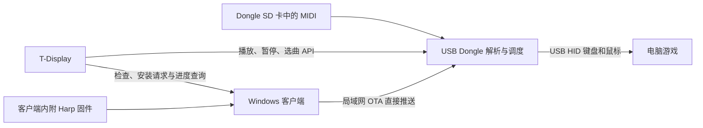

# Harp USB MIDI 播放器

工程将 MIDI 解析和按键时序放在 USB Dongle 上运行。T-Display 负责选曲、播放/暂停等遥控，
Windows 客户端保存固件并直接向 Dongle 推送更新。播放时可以不运行 Windows 客户端。

## 代码与资料

| 内容 | 位置 |
| --- | --- |
| HarpAutoPlayer 1.0.6 静态分析、文件哈希、音域与时间规则 | [解析记录](HarpAutoPlayer解析.md) |
| USB 播放器源码、接线、构建、配对、完整 API | [esp32-usb-player](../firmware/esp32-usb-player/README.md) |
| T-Display 操作和烧录 | [屏幕说明](../firmware/t-display-s3/README.md) |
| 当前设备已测功能和未验证项 | [验证记录](../firmware/esp32-usb-player/VERIFIED.md) |
| Windows 固件校验与缓存 | `src/DeltaCrafter.Core/L1/DeviceFirmwareStore.cs` |
| Windows 直传更新任务 | `src/DeltaCrafter.Core/L1/HarpFirmwareUpdater.cs` |
| Windows 设置页 | `src/DeltaCrafter.App/Pages/SettingsPage.xaml` |
| 屏幕播放控制 / 更新遥控 | `firmware/t-display-s3/src/harp_control.cpp` / `harp_update.cpp` |

## 设备信息

| 项目 | 当前设备 |
| --- | --- |
| 型号 | ESP32-S3-Dongle v1.0g |
| 芯片 | ESP32-S3FN8，8 MB Flash，无 PSRAM |
| 硬件依据 | [用户提供的 ESP32-S3-Dongle.pdf](hardware/ESP32-S3-Dongle.pdf) |
| SD 接口 | 板载卡座，SDMMC 1-bit：CLK GPIO36、CMD GPIO35、D0 GPIO37 |
| 其余 SD 引脚 | D1 GPIO38、D2 GPIO33、D3 / SPI CS GPIO34 |
| USB 功能 | 键盘、鼠标、MSC 读卡器、CDC 串口复合设备 |
| SD 文件系统 | exFAT，卷名 `DELTAHARP`；也支持读取 FAT32 |
| USB 固件 | `delta-harp-v3`，`esp32-s3-dongle-fn8` / `dual-8mb-v1` |
| 屏幕固件 | `axeuh-tools-v29`，基于现有 LILYGO T-Display-S3 项目 |

当前设备 USB 序列号、SD 标识及曾分配的 LAN 地址见验证记录；DHCP 地址可能变化。
BE6500PRO 的已有 Wi-Fi 配置通过本地配置写入设备 NVS。播放器密钥及热点凭据保存在本地
`firmware/esp32-usb-player/player.local.json`（已忽略），原始 Flash 备份在该目录的 `backups/`。
源码和公开固件包不包含这些秘密。Windows 中的播放器配置保存于本机
`%LocalAppData%\DeltaCrafter\settings.json` 的 `harpPlayer`，不通过状态 API 返回密钥。

## 数据流

播放器发现使用 UDP 40110 广播，Windows 和屏幕各自扫描、选择同一设备。网络配对时自动保存密钥和设备 ID；不经过 USB。
首次运行开放 60 秒配对窗口，之后运行时按住 BOOT 一秒重新开放。已配对设备通过稳定 ID 找回新地址。

更新数据不经过屏幕。屏幕关机、断网或返回菜单不终止客户端任务。
Windows 退出或网络中断时，未完成的上传不会切换启动分区；重试需重新检查。
固件成功提交后会重启；当前未启用启动崩溃自动回滚，此类故障使用 USB 恢复。

## 日常使用与更新

1. 插入 Dongle，将 `.mid` / `.midi` / `.kar` 文件复制到 `DELTAHARP`。
2. 在操作系统弹出**整张磁盘**，保持 Dongle 插着。屏幕刷新曲库、选择曲目并播放。
3. 要再次复制音乐，在屏幕选择 USB 读卡器。SD 卡只能由电脑或本地播放器的一方持有。
4. 更新时，在 Windows「设置 → T-Display-S3」扫描 Harp，选择并连接。
   客户端内附 `Firmware/DeltaHarp-esp32s3-usb.zip`，也支持导入替换。使用检查/安装按钮可直接更新。
5. 屏幕发起更新还需配对 Windows API，并在客户端开启 API 和允许设备控制。
   屏幕与客户端选择同一播放器。进入「工具 → 口琴播放器 → Harp 固件更新」。
   客户端调用 `/api/v1/firmware/begin`，USB S3 自己停止播放，等待两秒无设备读写、同步卡并撤下 USB 媒体。
   设备忙时客户端等待重试，取消/失败/超时后恢复读卡模式。无需 Windows 磁盘操作。
   S3 不能刷新电脑未提交的写缓存，更新前应结束复制文件；这不是操作系统的安全弹出。

播放器至少 v3，屏幕至少 v29；旧版先安装兼容固件。三者需通过局域网互通。
播放器重启后恢复 USB 读卡模式，下一次播放前再次弹出磁盘。

## API 分工

广播协议端口为 UDP 40110。控制端广播 `{"type":"delta-harp-discover","protocol":1,"nonce":"32位随机十六进制"}`；
播放器单播回应 `type=delta-harp-device`、相同 `nonce`、`deviceId`、`name`、`firmware`、`board`、HTTP `port=80`、
`pairable`，仅在配对窗口内附 `challenge`。控制端使用包的源 IP，不信任广播中提供的地址。
窗口内向该 IP 的 `POST /api/v1/pair` 发送 `deviceId` 和 `challenge`，取回 API 密钥并本地保存。
单次扫描约 2.7 秒，支持多设备选择；Windows 每次更新检查/安装前按已配对 ID 重新发现。
路由器的客户端隔离或广播过滤会导致扫描不到；首次配网与播放器配对是不同操作。

所有请求使用相应服务的 `Authorization: Bearer <密钥>`。桌面密钥与播放器密钥互相独立。

| 接收方 | 接口 | 用途 |
| --- | --- | --- |
| Windows | `POST /api/v1/harp/update/action` | 异步提交检查或安装 |
| Windows | `GET /api/v1/harp/update` | 查询当前后台任务 |
| Windows | `GET /api/v1/harp/firmware` | 工具查询当前内附/导入的固件清单 |
| Windows | `GET /api/v1/harp/firmware-image?bundle=…&role=player` | 工具读取固定包镜像；屏幕不用此接口 |
| Dongle | `GET /api/v1/status`、`GET /api/v1/songs` | 状态和曲库 |
| Dongle | `POST /api/v1/play`、`pause`、`resume`、`stop` | 播放控制，完整路径均以 `/api/v1/` 开头 |
| Dongle | `GET /api/v1/firmware` | 板型、版本、分区、上传进度 |
| Dongle | `POST /api/v1/firmware/begin`、`chunk`、`commit`、`abort` | Windows 直接调用的 OTA 事务 |

检查请求示例：`{"action":"check","requestId":"32位十六进制唯一ID"}`。
安装请求再加上检查完成后的 `checkId`。客户端立即返回 202 后独立运行；同一当前请求 ID 返回已有任务。
`playerId`（旧配置可用 `playerUrl`）可用于核对客户端本地配对，但远端不能提供凭据或指定任意新地址作为推送目标。
最多每秒查询一次；`busy=false` 后查看 `phase`，`complete` 才代表已确认重启成功。
进度丢失不代表任务失败，重新查询即可。完整协议参数见固件 README。

## MIDI 与原程序差异

基本键位与原程序一致：C D E F G A B → Z X C V B N M，低八度加左键、高八度加右键、
升半音加中键；最高 C / C♯ 使用逗号键加右键。基准八度按曲目自动选择，可覆盖 38 个半音。

ESP32 使用 TinyMidiLoader，支持 SMF 0/1、PPQN 及速度变化，上限 32 轨、512 KiB 文件、
160 KiB 解析分配和一小时曲长；可用堆内存可能进一步限制复杂曲目。自动选择单旋律轨道/通道，
重叠取最高活动音，支持延音控制。未移植原程序多声部合奏、人声旋律筛选、RMI 包装和拖动进度。
本实现发送 USB HID，原程序使用 Windows `SendInput`。键位映射相同不代表调度细节完全相同。
原程序仅完成静态分析，实际游戏发声和时序尚未验证。
